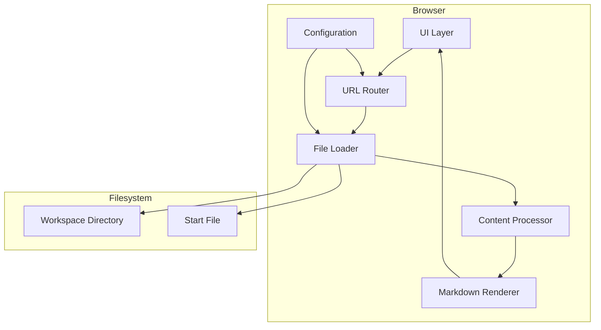
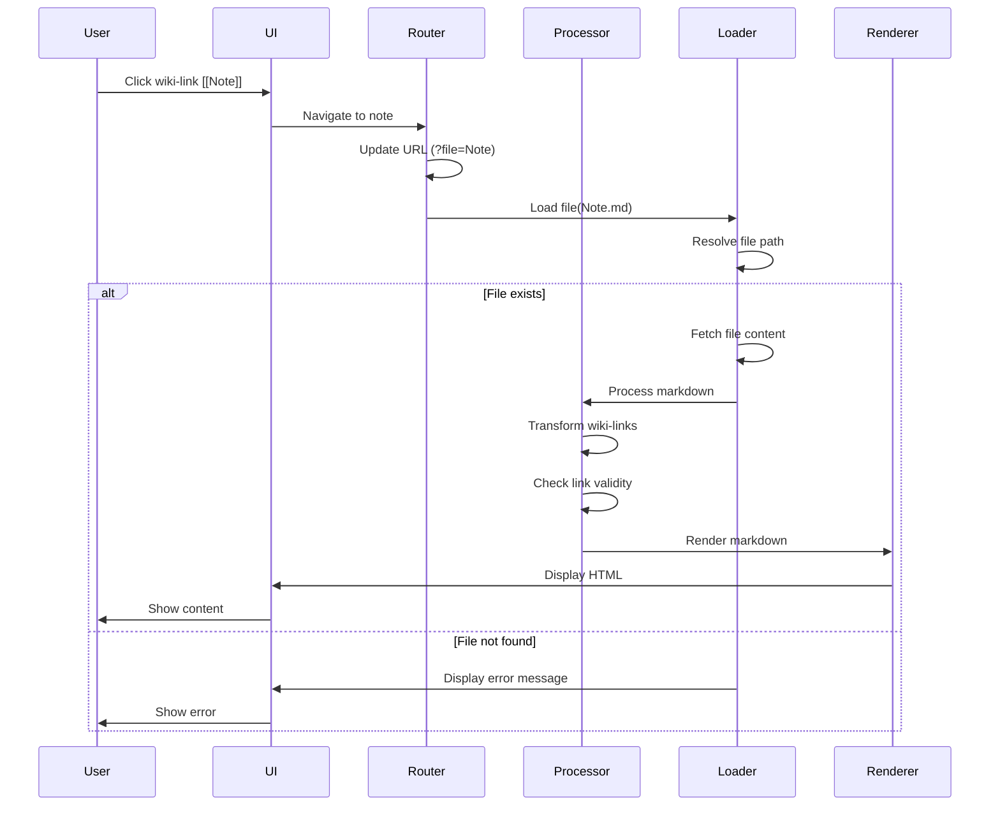
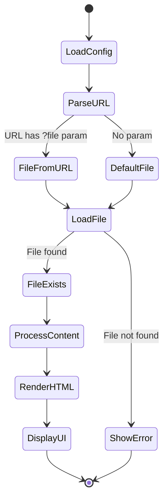

# Design Document

## Overview

This feature delivers a browser-based markdown viewer with Obsidian wiki-link support to users who want to read and navigate interconnected markdown notes without requiring the Obsidian application. The viewer provides a static HTML solution that renders markdown files from a configurable workspace directory and enables seamless navigation through `[[wiki-link]]` references.

**Users**: Knowledge workers, documentation maintainers, and content creators using Obsidian-style markdown files will utilize this for viewing and sharing their note collections through a simple web interface.

**Impact**: Creates a new standalone HTML application in the `./2o` directory that operates independently from existing codebase components. No modifications to existing systems required.

### Goals
- Enable browser-based viewing of Obsidian markdown workspaces without requiring Obsidian application
- Support wiki-link navigation (`[[Title]]` syntax) with visual feedback for broken links
- Provide zero-configuration deployment as static HTML site
- Allow easy workspace and start file configuration without code changes

### Non-Goals
- Full Obsidian feature parity (plugins, graph view, live editing)
- Backend server implementation or API endpoints
- Bidirectional link analysis or backlinks visualization
- Mobile-optimized responsive design (desktop-first approach)
- Multi-workspace switching within same session

## Architecture

### Architecture Pattern & Boundary Map

**Selected Pattern**: Client-Side Single-Page Application (SPA)

The architecture follows a layered client-side pattern with clear separation between configuration, file loading, markdown processing, and UI rendering. This pattern was selected for its alignment with the static deployment requirement and zero-backend constraint.



**Architecture Integration**:
- **Selected pattern**: Client-side SPA with layered architecture - chosen for static deployment requirement (5.2, 5.3), no server dependency, and simple configuration updates (3.4)
- **Domain boundaries**:
  - Configuration layer manages workspace settings (3.1, 3.2)
  - File loading layer handles filesystem access and caching (4.1, 4.2)
  - Processing layer transforms wiki-links and validates references (2.1, 2.4)
  - Rendering layer produces HTML output from markdown (1.1, 1.3)
  - UI layer manages display and user interactions (6.1, 6.2)
- **Existing patterns preserved**: No existing patterns to preserve (greenfield implementation)
- **New components rationale**: Each layer serves a distinct responsibility to enable parallel development and independent testing
- **Steering compliance**: No steering context available; design follows standard web application best practices

### Technology Stack

| Layer | Choice / Version | Role in Feature | Notes |
|-------|------------------|-----------------|-------|
| Markdown Parser | marked.js v17.0.1 | Parse markdown to HTML with extension support | Lightweight (40KB), 98% CommonMark compliant, browser-compatible |
| File Loading | Fetch API (native) | Load markdown files from workspace directory | Native browser API, supports relative paths |
| URL Routing | History API + URLSearchParams (native) | Client-side navigation with query parameters | Query param approach (`?file=note`) for `file://` protocol compatibility |
| UI Rendering | Vanilla JavaScript DOM API | Render content and handle interactions | No framework overhead, simple DOM manipulation sufficient |
| Sanitization | DOMPurify v3.x (optional) | HTML sanitization for untrusted content | Not required for trusted local files per research.md |

## System Flows

### Wiki-Link Navigation Flow



**Key Decisions**:
- URL update occurs before file loading to enable browser back/forward navigation
- File existence check happens during wiki-link processing to apply appropriate styling
- Error handling at loader level prevents cascading failures in processor/renderer

### Application Initialization Flow



**Key Decisions**:
- Configuration loaded first to establish workspace directory and start file
- URL parameters take precedence over default start file (2.9)
- Errors displayed immediately rather than retrying to provide clear feedback (6.4)

## Requirements Traceability

| Requirement | Summary | Components | Interfaces | Flows |
|-------------|---------|------------|------------|-------|
| 1.1, 1.2, 1.3, 1.4 | Markdown file rendering with formatting preservation | MarkdownRenderer, FileLoader | RendererService, LoaderService | Initialization |
| 2.1, 2.2, 2.3 | Wiki-link identification and clickable conversion | WikiLinkProcessor, LinkResolver | ProcessorService | Navigation |
| 2.4, 2.5 | Broken link handling with visual feedback | LinkValidator, UIRenderer | ValidatorService, UIService | Navigation |
| 2.6, 2.7 | Advanced wiki-link syntax (alias, paths) | WikiLinkProcessor | ProcessorService | Navigation |
| 2.8, 2.9, 2.10 | URL parameter navigation | URLRouter, FileLoader | RouterService, LoaderService | Initialization, Navigation |
| 3.1, 3.2, 3.3, 3.4 | Workspace configuration | ConfigurationManager | ConfigService | Initialization |
| 3.5, 3.6 | Configuration validation and error handling | ConfigurationManager, ErrorHandler | ConfigService, ErrorService | Initialization |
| 4.1, 4.2, 4.3, 4.4, 4.5 | File system integration and resolution | FileLoader, PathResolver | LoaderService, ResolverService | Navigation |
| 5.1, 5.2, 5.3, 5.4 | Deployment and accessibility | Application (root), FileLoader | - | - |
| 6.1, 6.2, 6.3, 6.4, 6.5 | User interface and display | UIRenderer, ErrorHandler | UIService, ErrorService | All flows |

## Components and Interfaces

| Component | Domain/Layer | Intent | Req Coverage | Key Dependencies (P0/P1) | Contracts |
|-----------|--------------|--------|--------------|--------------------------|-----------|
| ConfigurationManager | Configuration | Manage workspace and start file settings | 3.1-3.6 | None | State |
| FileLoader | File Access | Load markdown files from workspace | 1.2, 2.3, 2.9, 4.1-4.5 | ConfigurationManager (P0), PathResolver (P0) | Service |
| PathResolver | File Access | Resolve wiki-link targets to file paths | 2.7, 4.3 | ConfigurationManager (P0) | Service |
| WikiLinkProcessor | Content Processing | Transform wiki-links to markdown links | 2.1, 2.2, 2.6, 2.7 | LinkValidator (P1) | Service |
| LinkValidator | Content Processing | Check file existence for wiki-links | 2.4, 2.5 | FileLoader (P0) | Service |
| MarkdownRenderer | Rendering | Convert markdown to HTML | 1.1, 1.3, 1.4 | marked.js (P0) | Service |
| UIRenderer | UI | Display content and handle interactions | 6.1-6.5 | MarkdownRenderer (P0), ErrorHandler (P0) | Service |
| URLRouter | Navigation | Manage URL-based routing | 2.8, 2.9, 2.10 | FileLoader (P0) | Service |
| ErrorHandler | Cross-cutting | Display error messages | 3.5, 3.6, 6.4 | UIRenderer (P0) | Service |

### Configuration Layer

#### ConfigurationManager

| Field | Detail |
|-------|--------|
| Intent | Provide centralized access to workspace directory and start file configuration |
| Requirements | 3.1, 3.2, 3.3, 3.4, 3.5, 3.6 |

**Responsibilities & Constraints**
- Store and validate workspace directory path and start file path
- Provide immutable configuration access to other components
- Validate configuration values on initialization
- Fail fast with clear error messages for invalid configuration

**Dependencies**
- Outbound: None (root configuration layer)

**Contracts**: State [X]

##### State Management

```typescript
interface Configuration {
  workspaceDir: string;      // Relative path to workspace directory (e.g., "carrinhos")
  startFile: string;          // Default file to load (e.g., "index.md")
}

interface ConfigurationState {
  readonly config: Configuration;
  readonly isValid: boolean;
  readonly errors: string[];
}
```

- **State model**: Immutable configuration object set on initialization
- **Persistence**: Inline JavaScript object in HTML file
- **Consistency**: Validated on load; application fails to start if invalid
- **Concurrency**: Read-only after initialization; no concurrent writes

**Implementation Notes**
- **Integration**: Defined as JavaScript object in main HTML file before application initialization
- **Validation**: Check `workspaceDir` and `startFile` are non-empty strings; validate paths exist using FileLoader
- **Risks**: Invalid paths will cause startup failure; provide clear error message guiding user to fix configuration

### File Access Layer

#### FileLoader

| Field | Detail |
|-------|--------|
| Intent | Load markdown file content from workspace directory using relative paths |
| Requirements | 1.2, 2.3, 2.9, 4.1, 4.2, 4.3, 4.4, 4.5 |

**Responsibilities & Constraints**
- Load file content using Fetch API with relative paths
- Handle file not found errors gracefully
- Support nested directory structures within workspace
- Handle special characters and spaces in filenames
- Cache file existence checks to optimize performance

**Dependencies**
- Inbound: URLRouter, WikiLinkProcessor, LinkValidator — file loading requests (P0)
- Outbound: ConfigurationManager — workspace directory path (P0), PathResolver — file path resolution (P0)
- External: Fetch API (browser native) — HTTP requests for file content (P0)

**Contracts**: Service [X]

##### Service Interface

```typescript
interface FileLoaderService {
  loadFile(filename: string): Promise<Result<string, FileError>>;
  fileExists(filename: string): Promise<boolean>;
  resolveFilePath(wikiLink: string): string;
}

type Result<T, E> =
  | { success: true; data: T }
  | { success: false; error: E };

interface FileError {
  type: 'not_found' | 'access_denied' | 'invalid_format' | 'network_error';
  message: string;
  filename: string;
}
```

- **Preconditions**: Configuration must be initialized and valid
- **Postconditions**: Returns file content string or specific error type
- **Invariants**: File paths always resolved relative to workspace directory; never access parent directories

**Implementation Notes**
- **Integration**: Use `fetch(workspaceDir + '/' + filename)` with relative paths; handle `.md` and `.markdown` extensions
- **Validation**: Check response status; 404 → `not_found`, 403 → `access_denied`, other → `network_error`
- **Risks**: Browser CORS policies may block file access; document requirement to serve via local web server or ensure proper directory structure

#### PathResolver

| Field | Detail |
|-------|--------|
| Intent | Resolve wiki-link references to actual file paths with extension handling |
| Requirements | 2.7, 4.3 |

**Responsibilities & Constraints**
- Convert wiki-link text to file paths (e.g., `[[Note]]` → `workspace/Note.md`)
- Handle subdirectory paths (e.g., `[[folder/note]]` → `workspace/folder/note.md`)
- Try multiple file extensions (.md, .markdown)
- Normalize paths for case-insensitive filesystems

**Dependencies**
- Inbound: FileLoader, WikiLinkProcessor — path resolution requests (P0)
- Outbound: ConfigurationManager — workspace directory path (P0)

**Contracts**: Service [X]

##### Service Interface

```typescript
interface PathResolverService {
  resolvePath(wikiLink: string): string[];  // Returns candidate paths to try
  normalizePath(path: string): string;
}
```

- **Preconditions**: Wiki-link text must be non-empty
- **Postconditions**: Returns array of candidate file paths ordered by likelihood
- **Invariants**: All returned paths are relative to workspace directory

**Implementation Notes**
- **Integration**: Called by FileLoader before fetch; returns `['{link}.md', '{link}.markdown']` for each link
- **Validation**: Strip `[[`, `]]`, and split on `|` to extract target; handle `/` path separators
- **Risks**: Case sensitivity differs across OSes; normalize to lowercase for comparison but preserve original for display

### Content Processing Layer

#### WikiLinkProcessor

| Field | Detail |
|-------|--------|
| Intent | Transform Obsidian wiki-link syntax to standard markdown links before rendering |
| Requirements | 2.1, 2.2, 2.6, 2.7 |

**Responsibilities & Constraints**
- Identify all `[[link]]` patterns in markdown content
- Transform to markdown link syntax `[text](path)`
- Handle alias syntax `[[target|display]]` → `[display](target)`
- Handle subdirectory paths `[[folder/note]]`
- Preserve original text for broken links

**Dependencies**
- Inbound: Application initialization flow — content preprocessing (P0)
- Outbound: LinkValidator — check link validity (P1), PathResolver — resolve paths (P0)

**Contracts**: Service [X]

##### Service Interface

```typescript
interface WikiLinkProcessorService {
  processContent(markdown: string): Promise<ProcessedContent>;
}

interface ProcessedContent {
  markdown: string;           // Transformed markdown with links converted
  links: WikiLink[];          // Extracted links with metadata
}

interface WikiLink {
  original: string;           // Original [[text]]
  target: string;             // Target file name
  displayText: string | null; // Display text if alias used
  isValid: boolean;           // Whether target file exists
  resolvedPath: string;       // Resolved file path
}
```

- **Preconditions**: Input markdown must be valid UTF-8 string
- **Postconditions**: All wiki-links converted to markdown links; broken links marked with CSS class
- **Invariants**: Original content structure preserved; only wiki-link syntax transformed

**Implementation Notes**
- **Integration**: Called after FileLoader and before MarkdownRenderer; use regex `/\[\[([^|\]]+)(?:\|([^\]]+))?\]\]/g` to match
- **Validation**: Extract target and display text; validate target exists via LinkValidator; apply `.broken-link` class if invalid
- **Risks**: Complex nested syntax may cause false matches; test with edge cases like `[[a|b|c]]`

#### LinkValidator

| Field | Detail |
|-------|--------|
| Intent | Validate wiki-link targets exist in workspace and provide existence cache |
| Requirements | 2.4, 2.5 |

**Responsibilities & Constraints**
- Check if wiki-link target file exists in workspace
- Cache existence results to avoid redundant file system checks
- Provide fast synchronous access after initial async check
- Invalidate cache when necessary (not implemented initially)

**Dependencies**
- Inbound: WikiLinkProcessor — link validation requests (P0), UIRenderer — tooltip display (P1)
- Outbound: FileLoader — file existence checks (P0)

**Contracts**: Service [X]

##### Service Interface

```typescript
interface LinkValidatorService {
  validateLink(target: string): Promise<boolean>;
  getCachedValidity(target: string): boolean | null;
  prefetchWorkspace(): Promise<void>;  // Optional optimization
}
```

- **Preconditions**: FileLoader must be initialized
- **Postconditions**: Returns true if file exists, false otherwise; result cached
- **Invariants**: Cache consistency maintained across navigation; cache never returns stale positives (file deleted)

**Implementation Notes**
- **Integration**: Called by WikiLinkProcessor for each wiki-link; use Map<string, boolean> for cache
- **Validation**: Use FileLoader.fileExists() for actual check; cache indefinitely (no invalidation in v1)
- **Risks**: Large workspaces may require many checks; implement lazy loading by checking only links in current document

### Rendering Layer

#### MarkdownRenderer

| Field | Detail |
|-------|--------|
| Intent | Convert markdown text to HTML using marked.js library |
| Requirements | 1.1, 1.3, 1.4 |

**Responsibilities & Constraints**
- Parse markdown syntax to HTML
- Preserve formatting including nested structures and multi-line blocks
- Configure marked.js options for security and compatibility
- Handle rendering errors gracefully

**Dependencies**
- Inbound: Application rendering flow — markdown to HTML conversion (P0)
- Outbound: None
- External: marked.js v17.0.1 — markdown parsing (P0)

**Contracts**: Service [X]

##### Service Interface

```typescript
interface MarkdownRendererService {
  render(markdown: string): Result<string, RenderError>;
  configure(options: MarkedOptions): void;
}

interface RenderError {
  type: 'parse_error' | 'invalid_syntax';
  message: string;
  line?: number;
}

interface MarkedOptions {
  breaks: boolean;        // GFM line breaks
  gfm: boolean;           // GitHub Flavored Markdown
  headerIds: boolean;     // Generate heading IDs
  mangle: boolean;        // Mangle email addresses
}
```

- **Preconditions**: Input markdown must be string; marked.js library loaded
- **Postconditions**: Returns valid HTML string or error
- **Invariants**: Output HTML is safe for insertion into DOM (no script injection from markdown)

**Implementation Notes**
- **Integration**: Call `marked.parse()` with preprocessed markdown; configure with GFM enabled, breaks enabled
- **Validation**: marked.js handles parsing validation; wrap in try-catch for unexpected errors
- **Risks**: Marked.js does not sanitize HTML; acceptable for trusted local files per requirements; add warning in documentation

### UI Layer

#### UIRenderer

| Field | Detail |
|-------|--------|
| Intent | Display rendered content and handle user interactions including hover effects and scrolling |
| Requirements | 6.1, 6.2, 6.3, 6.4, 6.5 |

**Responsibilities & Constraints**
- Display current note title or filename in header
- Render HTML content into main content area
- Provide visual feedback for clickable links (hover effects)
- Display error messages for failed operations
- Handle content scrolling for long documents

**Dependencies**
- Inbound: Application main loop — UI updates (P0)
- Outbound: MarkdownRenderer — HTML content (P0), ErrorHandler — error display (P0)

**Contracts**: Service [X]

##### Service Interface

```typescript
interface UIRendererService {
  renderContent(html: string, title: string): void;
  showError(error: ErrorMessage): void;
  addLinkHoverEffects(): void;
  scrollToTop(): void;
}

interface ErrorMessage {
  type: 'warning' | 'error' | 'info';
  title: string;
  message: string;
  actions?: ErrorAction[];
}

interface ErrorAction {
  label: string;
  handler: () => void;
}
```

- **Preconditions**: DOM elements (`#content`, `#title`, `#error`) must exist
- **Postconditions**: Content displayed in UI; appropriate CSS classes applied
- **Invariants**: Only one error message displayed at a time; content updates replace previous content

**Implementation Notes**
- **Integration**: Use `innerHTML` for content insertion; `textContent` for title; CSS classes for styling
- **Validation**: Sanitize title to prevent XSS; HTML content assumed safe from MarkdownRenderer
- **Risks**: innerHTML can execute scripts if HTML malformed; acceptable for trusted markdown sources

#### URLRouter

| Field | Detail |
|-------|--------|
| Intent | Manage client-side navigation using URL query parameters and History API |
| Requirements | 2.8, 2.9, 2.10 |

**Responsibilities & Constraints**
- Parse `?file=` query parameter on page load
- Update URL when navigating to new notes without page refresh
- Handle browser back/forward navigation
- Fall back to default start file when no parameter present

**Dependencies**
- Inbound: Application initialization, wiki-link click handlers — navigation requests (P0)
- Outbound: FileLoader — load target file (P0), UIRenderer — update display (P0)

**Contracts**: Service [X]

##### Service Interface

```typescript
interface URLRouterService {
  getCurrentFile(): string | null;
  navigateToFile(filename: string): void;
  initializeRouting(): void;
  onRouteChange(handler: RouteChangeHandler): void;
}

type RouteChangeHandler = (filename: string | null) => void;
```

- **Preconditions**: History API supported by browser
- **Postconditions**: URL reflects current file; navigation triggers content load
- **Invariants**: URL always in sync with displayed content; back/forward navigation works correctly

**Implementation Notes**
- **Integration**: Use `URLSearchParams` to parse `window.location.search`; `history.pushState()` to update URL
- **Validation**: Decode URI components using `decodeURIComponent()`; handle special characters
- **Risks**: `file://` protocol has limited History API support; test behavior and document limitations

#### ErrorHandler

| Field | Detail |
|-------|--------|
| Intent | Centralized error handling and user-facing error message display |
| Requirements | 3.5, 3.6, 6.4 |

**Responsibilities & Constraints**
- Format error messages for user display
- Provide actionable error messages with context
- Log errors for debugging (console.error)
- Map technical errors to user-friendly messages

**Dependencies**
- Inbound: All components — error reporting (P0)
- Outbound: UIRenderer — display error UI (P0)

**Contracts**: Service [X]

##### Service Interface

```typescript
interface ErrorHandlerService {
  handleError(error: ApplicationError): void;
  clearErrors(): void;
}

type ApplicationError =
  | { type: 'file_not_found'; filename: string }
  | { type: 'invalid_config'; field: string; reason: string }
  | { type: 'network_error'; message: string }
  | { type: 'render_error'; message: string };
```

- **Preconditions**: UIRenderer initialized
- **Postconditions**: Error displayed to user; logged to console
- **Invariants**: All errors handled gracefully; no uncaught exceptions propagate to user

**Implementation Notes**
- **Integration**: Called by components on error conditions; formats message and calls UIRenderer.showError()
- **Validation**: Map error types to templates: file_not_found → "File '{filename}' not found in workspace"
- **Risks**: Generic error messages may not provide enough debugging context; balance user-friendliness with detail

## Data Models

### Domain Model

The application operates on a simple document-based domain with minimal state management:

**Entities**:
- **Workspace**: Collection of markdown files in a directory structure
  - Attributes: root directory path
  - Invariants: Must contain at least one markdown file

- **Note**: Individual markdown file with content and metadata
  - Attributes: filename, content (markdown text), title, wiki-links
  - Invariants: Filename must be unique within workspace; content is valid UTF-8

- **WikiLink**: Reference from one note to another
  - Attributes: source note, target note, display text, validity status
  - Invariants: Source exists; target may or may not exist

**Value Objects**:
- **FilePath**: Relative path from workspace root
- **LinkText**: Display text for rendered links

**Business Rules**:
- Wiki-links to non-existent files are rendered as disabled (not removed)
- File extensions (.md, .markdown) are optional in wiki-link syntax
- Subdirectory paths in wiki-links use forward slash separator

### Logical Data Model

**Structure Definition**:

```typescript
// Configuration (stored as JavaScript object)
interface AppConfiguration {
  workspaceDir: string;    // Relative path to workspace
  startFile: string;        // Default file to load
}

// Runtime State (in-memory only)
interface ApplicationState {
  currentFile: string | null;
  currentContent: string | null;
  linkCache: Map<string, boolean>;
  isLoading: boolean;
}

// Transient Processing Data
interface ParsedNote {
  filename: string;
  title: string;
  rawContent: string;
  processedMarkdown: string;
  renderedHTML: string;
  wikiLinks: WikiLink[];
}
```

**Consistency & Integrity**:
- No persistent storage; all data is transient runtime state
- Link cache maintains eventual consistency with filesystem
- Configuration is immutable after initialization

## Error Handling

### Error Strategy

The application employs a fail-fast strategy with graceful degradation and clear user feedback. All errors are caught at component boundaries and transformed into user-facing messages with actionable guidance.

### Error Categories and Responses

**User Errors**:
- **Invalid wiki-link**: Target file does not exist
  - Response: Render link as grayed out with `.broken-link` CSS class
  - User action: Hover shows tooltip "File not found: {filename}"

- **Invalid URL parameter**: `?file=` specifies non-existent file
  - Response: Display error message "File '{filename}' not found in workspace"
  - User action: Provide link to return to start file

**System Errors**:
- **File load failure**: Network error or permissions issue
  - Response: Display error banner "Failed to load file: {reason}"
  - User action: Check file exists and server is running (if applicable)

- **Configuration invalid**: Missing or invalid workspace/start file
  - Response: Application fails to initialize with error overlay
  - User action: Edit HTML configuration object with correct paths

**Rendering Errors**:
- **Markdown parse error**: Malformed markdown syntax
  - Response: Display partial rendering with error indicator
  - User action: Check markdown syntax in source file

### Monitoring

**Client-Side Logging**:
- All errors logged to browser console with context (filename, error type, stack trace)
- Navigation events logged for debugging (file loads, link clicks)
- Performance metrics logged (load time, render time)

**No Server-Side Monitoring**: Static site has no backend; monitoring limited to client console

## Testing Strategy

### Unit Tests

**Configuration Management**:
- Validate configuration object structure
- Test invalid workspace directory handling
- Test invalid start file handling

**Path Resolution**:
- Test wiki-link to file path conversion for various syntaxes
- Test subdirectory path handling
- Test special characters and spaces in filenames
- Test multiple file extension attempts (.md, .markdown)

**Wiki-Link Processing**:
- Test basic wiki-link transformation `[[Note]]` → `[Note](Note.md)`
- Test alias syntax `[[Target|Display]]` → `[Display](Target.md)`
- Test subdirectory paths `[[folder/note]]`
- Test edge cases (nested brackets, empty links, special characters)

**Link Validation**:
- Test file existence checking
- Test cache behavior (hits and misses)
- Test broken link identification

### Integration Tests

**End-to-End Navigation Flow**:
- Load application with default start file
- Click wiki-link and verify content loads
- Verify URL parameter updates
- Click browser back button and verify navigation
- Test broken link click (no navigation)

**File Loading with Various Workspace Structures**:
- Flat workspace (all files in root)
- Nested workspace (files in subdirectories)
- Mixed extensions (.md and .markdown)
- Special characters in filenames

**Error Handling**:
- Invalid configuration prevents startup
- Missing file displays error message
- Network error (disconnect during load) shows error banner

### Browser Compatibility Tests

**File Protocol Access**:
- Test `file://` protocol in Chrome, Firefox, Safari
- Test relative path resolution
- Test fetch() behavior with local files

**URL Routing**:
- Test query parameter navigation
- Test History API pushState
- Test back/forward navigation
- Test bookmark/refresh behavior

### Performance Tests

**Large Workspace**:
- Load workspace with 500+ files
- Measure link validation cache performance
- Test navigation speed between files
- Memory usage over 50+ navigations

**Content Rendering**:
- Render note with 100+ wiki-links
- Render note with 1000+ lines of markdown
- Measure preprocessing + rendering time

## Security Considerations

### Threat Model

**Trusted Content Assumption**: All markdown files are from trusted local sources under user control. No untrusted user-generated content.

**Attack Vectors**:
- **XSS via markdown**: Malicious HTML/JavaScript in markdown files could execute in browser
  - Mitigation: Document trusted content assumption; optionally add DOMPurify for paranoid deployments

- **Path traversal**: Malicious wiki-links attempting to access files outside workspace
  - Mitigation: PathResolver enforces workspace-relative paths; reject `../` sequences

- **File disclosure**: Accessing sensitive files on local filesystem
  - Mitigation: Browser CORS policies prevent cross-origin access; workspace isolation enforced

### Authentication and Authorization

Not applicable - no user authentication required for local file viewing.

### Data Protection

**No Sensitive Data Transmission**: All data access is local; no network transmission of file contents.

**No Persistent Storage**: No localStorage or cookies used; purely transient runtime state.

## Performance & Scalability

### Target Metrics

- **Initial load**: < 500ms for application initialization
- **File load**: < 200ms for typical markdown file (< 100KB)
- **Link validation**: < 50ms for cache hit, < 500ms for workspace scan (500 files)
- **Rendering**: < 100ms for typical note (< 1000 lines)

### Optimization Strategies

**Lazy Loading**:
- Validate wiki-links only in currently displayed note (not entire workspace)
- Defer cache population until links are clicked

**Caching**:
- Cache link validation results indefinitely (no invalidation in v1)
- Cache file content for back/forward navigation (future enhancement)

**Rendering**:
- Marked.js is pre-optimized for performance (~40KB, fast parsing)
- No virtual DOM overhead; direct innerHTML insertion

### Scalability Limits

**Client-Side Constraints**:
- Large workspaces (1000+ files) may cause slow link validation
- Very large files (> 1MB) may cause rendering delays
- Browser memory limits may cap cache size

**Mitigation**: Document recommended workspace sizes (< 1000 files, < 500KB per file); provide configuration option to disable link validation for large workspaces.
