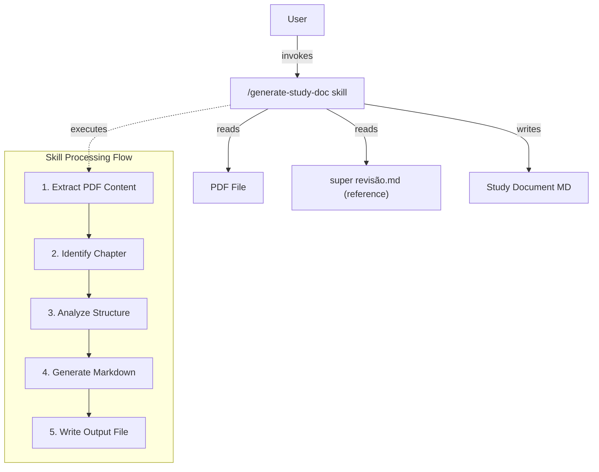
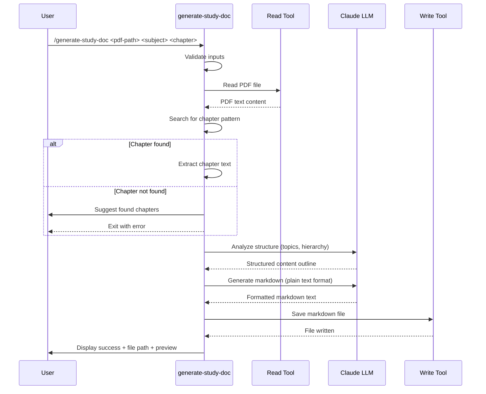
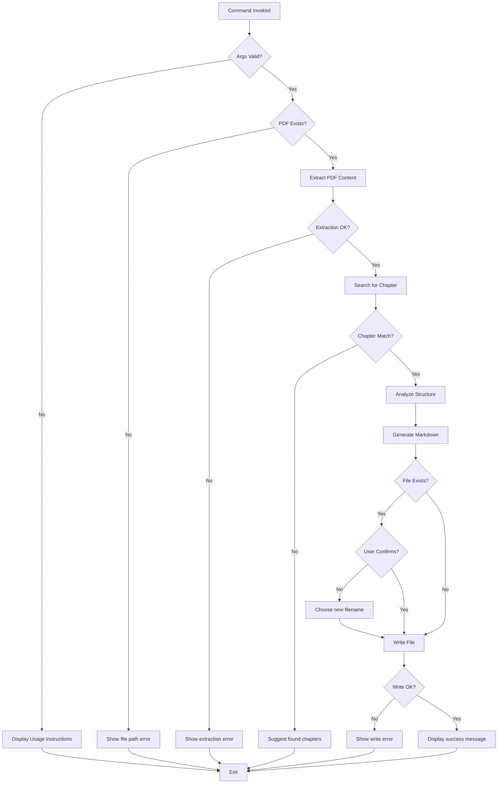

# Technical Design Document

## Overview

This feature delivers a Claude Code skill command that processes PDF textbook chapters and generates structured study documents in markdown format. The command extracts content from a specified chapter of a PDF file and transforms it into hierarchical study notes matching the style of `super revisão.md` - featuring plain text topic lines, hierarchical bullet points, and no text formatting.

**Users**: Students and educators will utilize this for creating consistent, well-structured study materials from textbook PDFs without manual reformatting.

**Impact**: Introduces a new Claude Code skill (`/generate-study-doc`) that automates study document generation, reducing manual note-taking effort and ensuring consistent formatting across different subjects.

### Goals
- Extract and process specific chapters from PDF textbooks
- Generate markdown study documents matching reference style exactly
- Analyze content structure to identify topics, hierarchies, and relationships
- Operate exclusively on PDF content without external knowledge
- Complete processing within 2 minutes for typical chapters

### Non-Goals
- OCR or processing of scanned/image-based PDFs
- Multi-chapter batch processing
- Interactive editing or refinement of generated documents
- Translation or language conversion
- Integration with note-taking applications

## Architecture

### Architecture Pattern & Boundary Map

**Selected Pattern**: Command-Script Architecture (single self-contained skill file)

**Architecture Integration**:
- Selected pattern: Command-script with explicit phase separation (extract → identify → analyze → generate → persist)
- Domain/feature boundaries: Single skill boundary encapsulating all processing logic; no external service dependencies
- Existing patterns preserved: Follows SDD skill structure pattern (`.claude/commands/sdd/*.md`)
- New components rationale: Single skill file aligns with Claude Code extension model and keeps logic self-contained
- Steering compliance: No project steering context exists; design follows Claude Code skill conventions



### Technology Stack

| Layer | Choice / Version | Role in Feature | Notes |
|-------|------------------|-----------------|-------|
| CLI / Interface | Claude Code Skills (markdown) | Skill definition and execution framework | Frontmatter defines tools and args |
| Text Processing | Claude Code Read Tool | PDF text extraction and markdown generation | Native PDF support, no external libs needed |
| Content Analysis | Claude LLM (Sonnet 4.5) | Structure recognition, topic extraction, hierarchy analysis | Leverages comprehension capabilities |
| Output Generation | Claude Code Write Tool | Markdown file creation | Standard file I/O |

## System Flows

### Main Processing Sequence



### Error Handling Flow



## Requirements Traceability

| Requirement | Summary | Components | Interfaces | Flows |
|-------------|---------|------------|------------|-------|
| 1.1 | Accept PDF file path | InputValidator | CommandArgs | Main |
| 1.2 | Accept subject parameter | InputValidator | CommandArgs | Main |
| 1.3 | Accept chapter identifier | InputValidator | CommandArgs | Main |
| 1.4 | Display usage if missing params | InputValidator | ErrorOutput | Error |
| 1.5 | Validate PDF file exists | FileValidator | FileSystem | Main, Error |
| 1.6 | Display error if file missing | ErrorHandler | ErrorOutput | Error |
| 2.1 | Read and extract PDF text | PDFExtractor | Read Tool | Main |
| 2.2 | Preserve paragraph structure | PDFExtractor | Read Tool | Main |
| 2.3 | Identify chapter boundaries | ChapterIdentifier | TextSearch | Main, Error |
| 2.4 | Suggest chapters if not found | ChapterIdentifier | ErrorOutput | Error |
| 2.5 | Extract chapter content only | ChapterExtractor | TextProcessing | Main |
| 2.6 | Handle multi-page chapters | PDFExtractor | Read Tool | Main |
| 2.7 | Report encrypted PDF error | ErrorHandler | ErrorOutput | Error |
| 3.1-3.6 | Analyze content structure | ContentAnalyzer | LLM Analysis | Main |
| 4.1-4.12 | Generate markdown | MarkdownGenerator | LLM Generation | Main |
| 5.1-5.6 | Content fidelity | ContentAnalyzer, MarkdownGenerator | Constraint Enforcement | Main |
| 6.1-6.12 | Formatting style | MarkdownGenerator | Format Rules | Main |
| 7.1-7.6 | Output and file handling | FileWriter | Write Tool | Main, Error |
| 8.1-8.7 | Error handling and feedback | ErrorHandler, StatusReporter | User Communication | Main, Error |

## Components and Interfaces

| Component | Domain/Layer | Intent | Req Coverage | Key Dependencies (Criticality) | Contracts |
|-----------|--------------|--------|--------------|-------------------------------|-----------|
| generate-study-doc Skill | CLI | Main entry point and orchestrator | All | Read (P0), Write (P0) | Command |
| InputValidator | Validation | Validate command arguments | 1.1-1.6 | None | Internal |
| PDFExtractor | PDF Processing | Extract text from PDF | 2.1-2.7 | Read Tool (P0) | Service |
| ChapterIdentifier | Text Processing | Find chapter boundaries | 2.3-2.5 | None | Service |
| ContentAnalyzer | Analysis | Identify topics and hierarchies | 3.1-3.6 | Claude LLM (P0) | Service |
| MarkdownGenerator | Generation | Create formatted markdown | 4.1-4.12, 5.1-5.6, 6.1-6.12 | Claude LLM (P0) | Service |
| FileWriter | I/O | Write markdown file | 7.1-7.6 | Write Tool (P0) | Service |
| ErrorHandler | Error Management | Handle errors and display messages | 1.6, 2.7, 8.1-8.7 | None | Service |
| StatusReporter | User Feedback | Progress and completion messages | 8.1-8.7 | None | Internal |

### CLI Layer

#### generate-study-doc Skill

| Field | Detail |
|-------|--------|
| Intent | Claude Code skill that orchestrates PDF-to-markdown study document generation |
| Requirements | All (1.1-8.7) |
| Owner / Reviewers | - |

**Responsibilities & Constraints**
- Orchestrate all processing phases sequentially
- Validate inputs and provide clear error messages
- Manage tool invocations (Read, Write)
- Ensure processing completes within 2 minutes for typical chapters
- Maintain no persistent state between invocations

**Dependencies**
- Inbound: User command invocation (P0)
- Outbound: Read Tool — PDF extraction and reference document access (P0)
- Outbound: Write Tool — Output file creation (P0)
- External: None

**Contracts**: Command [X] / Service [ ] / API [ ] / Event [ ] / Batch [ ] / State [ ]

##### Command Interface
```typescript
interface GenerateStudyDocCommand {
  arguments: CommandArguments;
  execute(): Result<StudyDocument, CommandError>;
}

interface CommandArguments {
  pdfPath: string;           // Absolute or relative path to PDF file
  subject: string;           // Subject name (e.g., "Artes", "História")
  chapterIdentifier: string; // Chapter ID (e.g., "2", "Cap. 3")
}

type CommandError =
  | { type: "MISSING_ARGUMENTS"; usage: string }
  | { type: "FILE_NOT_FOUND"; path: string }
  | { type: "PDF_READ_ERROR"; reason: string }
  | { type: "CHAPTER_NOT_FOUND"; suggestions: string[] }
  | { type: "FILE_WRITE_ERROR"; reason: string };

interface StudyDocument {
  content: string;     // Generated markdown text
  filePath: string;    // Output file location
  stats: {
    pageCount: number;
    wordCount: number;
  };
}
```

- **Preconditions**: Claude Code environment active, file system accessible
- **Postconditions**: Markdown file created or error displayed
- **Invariants**: No modification of input PDF; idempotent reads

**Implementation Notes**
- Integration: Skill file placed in `.claude/commands/` directory
- Validation: Check argument count and PDF file existence before processing
- Risks: Large PDFs may approach memory limits; chapter extraction mitigates this

### PDF Processing Layer

#### PDFExtractor

| Field | Detail |
|-------|--------|
| Intent | Extract text content from PDF files using Read Tool |
| Requirements | 2.1, 2.2, 2.6, 2.7 |

**Responsibilities & Constraints**
- Invoke Read Tool with PDF file path
- Extract all page text preserving structure
- Handle encrypted/protected PDFs gracefully
- Return structured text for downstream processing

**Dependencies**
- Inbound: generate-study-doc Skill (P0)
- Outbound: Read Tool — PDF text extraction (P0)

**Contracts**: Service [X]

##### Service Interface
```typescript
interface PDFExtractorService {
  extractText(filePath: string): Result<PDFContent, ExtractionError>;
}

interface PDFContent {
  text: string;        // Full extracted text
  pageCount: number;   // Number of pages processed
  metadata: {
    encrypted: boolean;
    hasImages: boolean;
  };
}

type ExtractionError =
  | { type: "FILE_NOT_READABLE"; path: string }
  | { type: "ENCRYPTED_PDF" }
  | { type: "EXTRACTION_FAILED"; reason: string };
```

- **Preconditions**: File path points to valid PDF
- **Postconditions**: Text extracted or error returned
- **Invariants**: No file modification

**Implementation Notes**
- Integration: Use Read Tool directly; no wrapper library needed
- Validation: Check Read Tool response for error indicators
- Risks: Image-based/scanned PDFs will fail; error message guides user

#### ChapterIdentifier

| Field | Detail |
|-------|--------|
| Intent | Locate chapter boundaries in extracted text |
| Requirements | 2.3, 2.4, 2.5 |

**Responsibilities & Constraints**
- Search for chapter identifier patterns in text
- Support multiple formats: "2", "Cap. 3", "Chapter 5"
- Identify start and end boundaries
- Suggest found chapters if target not located

**Dependencies**
- Inbound: generate-study-doc Skill (P0)
- Outbound: None

**Contracts**: Service [X]

##### Service Interface
```typescript
interface ChapterIdentifierService {
  findChapter(content: PDFContent, identifier: string): Result<ChapterBounds, ChapterError>;
  suggestChapters(content: PDFContent): string[];
}

interface ChapterBounds {
  start: number;    // Character offset of chapter start
  end: number;      // Character offset of chapter end
  text: string;     // Extracted chapter text
}

type ChapterError =
  | { type: "CHAPTER_NOT_FOUND"; suggestions: string[] }
  | { type: "AMBIGUOUS_CHAPTER"; matches: string[] };
```

- **Preconditions**: PDF content extracted
- **Postconditions**: Chapter boundaries identified or suggestions provided
- **Invariants**: Read-only operation on content

**Implementation Notes**
- Integration: Pattern matching using regex or LLM-based search
- Validation: Verify chapter end doesn't exceed content length
- Risks: Non-standard chapter formats may not match; flexible patterns mitigate

### Analysis Layer

#### ContentAnalyzer

| Field | Detail |
|-------|--------|
| Intent | Analyze chapter text to identify topics, hierarchies, and relationships |
| Requirements | 3.1, 3.2, 3.3, 3.4, 3.5, 3.6 |

**Responsibilities & Constraints**
- Parse chapter text into semantic units (topics, subtopics, details)
- Recognize key terms, definitions, dates, people, concepts
- Identify structural relationships (cause-effect, chronological, categorical)
- Extract contextual information
- Operate without external knowledge (PDF content only)

**Dependencies**
- Inbound: generate-study-doc Skill (P0)
- Outbound: Claude LLM — Content comprehension (P0)

**Contracts**: Service [X]

##### Service Interface
```typescript
interface ContentAnalyzerService {
  analyzeStructure(chapterText: string): Result<ContentOutline, AnalysisError>;
}

interface ContentOutline {
  topics: Topic[];
  imageReferences: ImageRef[];
}

interface Topic {
  name: string;                  // Topic name
  alternatives: string[];        // Alternative names in parentheses
  definition: string | null;     // Definition if present
  continuationText: string[];    // Plain text lines after topic
  bullets: BulletPoint[];        // Supporting details
}

interface BulletPoint {
  content: string;               // Bullet text ("Name - Definition" or plain)
  level: number;                 // Nesting level (0-based)
  subBullets: BulletPoint[];     // Nested bullets
}

interface ImageRef {
  number: number;                // Image sequence number
  description: string;           // Caption or description text
}

type AnalysisError =
  | { type: "EMPTY_CONTENT" }
  | { type: "STRUCTURE_UNCLEAR"; warnings: string[] };
```

- **Preconditions**: Chapter text extracted
- **Postconditions**: Structured content outline or analysis error
- **Invariants**: No external data incorporated; analysis deterministic for same input

**Implementation Notes**
- Integration: Detailed LLM prompt with examples from `super revisão.md`
- Validation: Verify outline has at least one topic; warn if structure minimal
- Risks: Complex or poorly structured textbooks may produce flat outlines

### Generation Layer

#### MarkdownGenerator

| Field | Detail |
|-------|--------|
| Intent | Transform content outline into formatted markdown matching reference style |
| Requirements | 4.1-4.12, 5.1-5.6, 6.1-6.12 |

**Responsibilities & Constraints**
- Generate markdown with exact formatting: plain text topics, hierarchical bullets
- Enforce NO bold/italic/other formatting
- Structure: `# Subject` → `## Cap. N` → topics → bullets
- Use 2-space indentation for nested bullets
- Create image placeholders `![][imageN]Description`
- Maintain content fidelity (no added information)

**Dependencies**
- Inbound: generate-study-doc Skill (P0)
- Outbound: Claude LLM — Markdown generation (P0)

**Contracts**: Service [X]

##### Service Interface
```typescript
interface MarkdownGeneratorService {
  generateMarkdown(
    subject: string,
    chapterIdentifier: string,
    outline: ContentOutline
  ): Result<string, GenerationError>;
}

type GenerationError =
  | { type: "FORMATTING_VIOLATION"; details: string }
  | { type: "EMPTY_OUTLINE" };
```

- **Preconditions**: Content outline complete
- **Postconditions**: Markdown text conforming to style rules
- **Invariants**: No content addition; formatting rules strictly followed

**Implementation Notes**
- Integration: LLM prompt with explicit anti-formatting instructions + examples
- Validation: Verify output has correct heading structure; check for bold markers
- Risks: LLM may add bold formatting; explicit examples and reminders mitigate

### I/O Layer

#### FileWriter

| Field | Detail |
|-------|--------|
| Intent | Write generated markdown to file system |
| Requirements | 7.1, 7.2, 7.3, 7.5, 7.6 |

**Responsibilities & Constraints**
- Generate filename from subject and chapter
- Check for existing file; prompt user if collision
- Invoke Write Tool to persist markdown
- Return file path for user display

**Dependencies**
- Inbound: generate-study-doc Skill (P0)
- Outbound: Write Tool — File I/O (P0)

**Contracts**: Service [X]

##### Service Interface
```typescript
interface FileWriterService {
  writeMarkdown(
    subject: string,
    chapter: string,
    content: string
  ): Result<string, WriteError>;
  checkFileExists(path: string): boolean;
}

type WriteError =
  | { type: "FILE_EXISTS"; path: string }
  | { type: "WRITE_FAILED"; reason: string }
  | { type: "PERMISSION_DENIED"; path: string };
```

- **Preconditions**: Generated markdown ready
- **Postconditions**: File written to disk or error returned
- **Invariants**: No overwrite without confirmation

**Implementation Notes**
- Integration: Use Write Tool; filename format `{subject}-{chapter}-study.md`
- Validation: Check write success; handle permission errors
- Risks: Disk full or permission issues; clear error messages guide resolution

### Support Components

#### ErrorHandler

| Field | Detail |
|-------|--------|
| Intent | Centralized error message formatting and display |
| Requirements | 1.6, 2.7, 8.1-8.7 |

**Implementation Notes**
- Formats error messages with context and actionable guidance
- Maps error types to user-friendly messages
- Provides suggestions for resolution

#### StatusReporter

| Field | Detail |
|-------|--------|
| Intent | Progress feedback during processing |
| Requirements | 8.1, 8.2, 8.5 |

**Implementation Notes**
- Reports phase transitions ("Reading PDF...", "Analyzing content...", etc.)
- Displays completion status and statistics
- Shows file path and preview on success

## Data Models

### Domain Model

**Aggregates**:
- **StudyDocument**: Root aggregate containing subject, chapter, and structured content
- **ContentOutline**: Aggregate of topics, bullets, and image references extracted from PDF

**Entities**:
- Topic (with name, alternatives, definition, continuation lines, bullets)
- BulletPoint (with content, nesting level, sub-bullets)

**Value Objects**:
- ChapterBounds (start/end positions)
- ImageRef (number, description)
- CommandArguments (paths, identifiers)

**Domain Events**: None (stateless command)

**Business Rules**:
- Topics may have definitions or be standalone names
- Bullets nest with 2-space indentation
- No text formatting permitted in content
- Image references numbered sequentially

### Logical Data Model

**Structure Definition**:

```typescript
// Command Input
interface CommandInput {
  pdfPath: string;           // File path to PDF
  subject: string;           // Subject name
  chapterIdentifier: string; // Chapter identifier
}

// Extracted Content
interface ExtractedChapter {
  fullText: string;          // Complete chapter text
  pageRange: {
    start: number;
    end: number;
  };
  wordCount: number;
}

// Analyzed Structure
interface AnalyzedContent {
  topics: Array<{
    name: string;
    alternatives: string[];
    definition: string | null;
    continuationLines: string[];
    bullets: Array<{
      content: string;
      level: number;          // 0-based nesting level
      children: BulletItem[]; // Recursive structure
    }>;
  }>;
  images: Array<{
    sequenceNumber: number;
    description: string;
  }>;
}

// Generated Output
interface GeneratedDocument {
  markdown: string;           // Complete markdown text
  metadata: {
    subject: string;
    chapter: string;
    generatedAt: string;      // ISO timestamp
    wordCount: number;
  };
}
```

**Consistency & Integrity**:
- No persistence; all data transient within command execution
- Image numbering must be sequential from 1
- Bullet nesting levels must increment by 1 (no gaps)

### Data Contracts & Integration

**Command Invocation**:
```bash
/generate-study-doc <pdf-path> <subject> <chapter-id>
```

Example:
```bash
/generate-study-doc ./textbooks/history.pdf "História" "Cap. 2"
```

**Output File Format**:
- Markdown text file (`.md` extension)
- UTF-8 encoding
- Unix line endings (LF)
- Filename pattern: `{subject}-{chapter}-study.md`
  - Lowercase, spaces replaced with hyphens
  - Example: `história-cap2-study.md`

## Error Handling

### Error Strategy
Sequential phase execution with fail-fast error handling. Each phase validates preconditions and returns explicit errors before proceeding.

### Error Categories and Responses

**User Errors**:
- Missing arguments → Display usage: `/generate-study-doc <pdf-path> <subject> <chapter>`
- Invalid PDF path → Show file not found error with provided path
- Chapter not found → Suggest detected chapters from PDF

**System Errors**:
- PDF read failure → Display extraction error with reason; suggest file repair
- Write permission denied → Show permission error; suggest checking file system access
- Memory limits → Extract only specified chapter to reduce load

**Business Logic Errors**:
- Empty chapter content → Report minimal content warning
- Unclear structure → Warn user but proceed with best-effort generation
- Encrypted PDF → Report encryption error; suggest decrypted version

### Monitoring
- Log phase transitions and timing for performance tracking
- Count successful vs. failed generations
- Track error types for improvement opportunities

## Testing Strategy

### Unit Tests
- InputValidator: Validate argument parsing and validation rules
- ChapterIdentifier: Test pattern matching with various identifier formats
- ContentAnalyzer: Verify topic and bullet extraction from sample text
- MarkdownGenerator: Ensure formatting rules enforced (no bold, proper indentation)
- FileWriter: Test filename generation and collision handling

### Integration Tests
- End-to-end: PDF file → markdown file with correct formatting
- Chapter extraction: Multi-chapter PDF → single chapter extracted correctly
- Error paths: Missing file, chapter not found, write failure scenarios
- Reference alignment: Generated output matches `super revisão.md` style

### E2E/UI Tests
- Full command execution: `/generate-study-doc ./sample.pdf "Artes" "2"` → success
- User interaction: File exists prompt → user chooses new name
- Error display: Clear, actionable error messages shown for failures

### Performance
- Typical chapter (10-20 pages): Complete under 2 minutes
- Large chapter (50+ pages): Warn user but complete under 5 minutes
- Chapter identification: Sub-second for most PDFs

## Optional Sections

### Security Considerations
- File system access: Read access to user-specified PDF path; write access to output directory
- No network access: Command operates entirely offline using PDF content
- Input validation: Sanitize file paths to prevent directory traversal
- No sensitive data: Study documents are user educational content; no encryption needed

### Performance & Scalability
**Target Metrics**:
- Typical processing time: Under 2 minutes for 10-20 page chapters
- Chapter identification: < 1 second
- Content analysis: 30-60 seconds
- Markdown generation: 20-40 seconds

**Optimization Strategies**:
- Extract only specified chapter (avoid full PDF processing)
- Stream text processing where possible
- Batch bullet point analysis to reduce LLM calls

**Scaling Concerns**:
- Not applicable: Single-user command execution, no concurrent requests
- Large PDFs mitigated by chapter-specific extraction

### Migration Strategy
Not applicable: New feature with no data migration requirements.

## Supporting References

None required: All design details fit within main document body.
