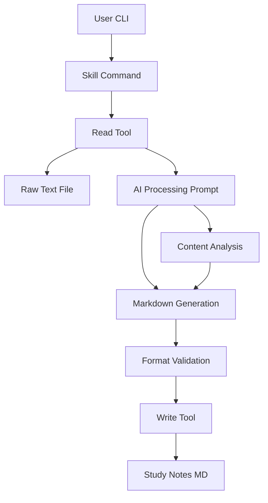
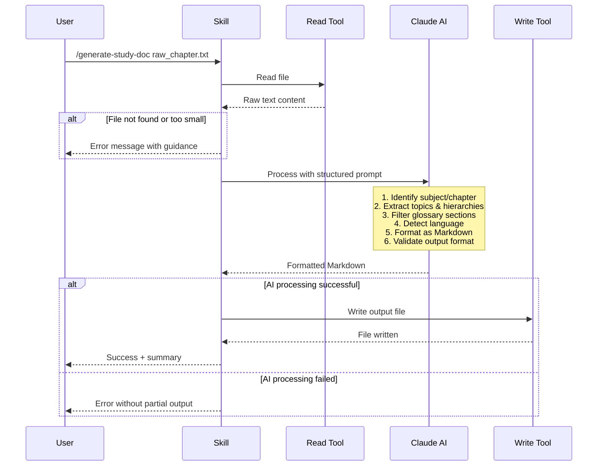
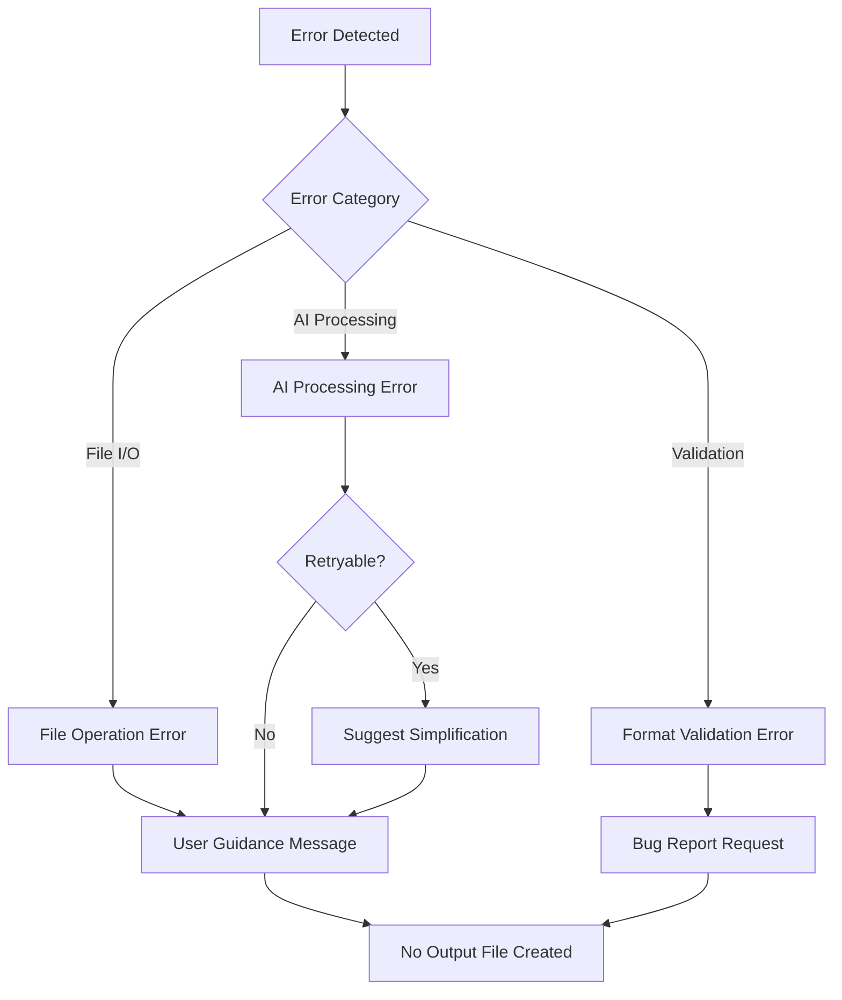

# Technical Design Document

## Overview

**Purpose**: This feature delivers a Claude Code skill command that transforms raw text files (extracted from PDF educational materials) into structured Markdown study documents. The system analyzes plain text chapter content and generates concise study notes following a specific hierarchical, bullet-point format.

**Users**: Students and educators will utilize this for converting unformatted PDF chapter extracts into organized study materials that match an established note-taking style.

**Impact**: Enables rapid creation of standardized study notes from raw textbook content without manual formatting or restructuring work.

### Goals
- Process plain text input (PDF extracts) into structured Markdown study documents
- Preserve exact source content without adding external knowledge or corrections
- Match the specific formatting style of existing study notes (plain text topics with `\-` separator, nested bullets)
- Support multi-language content with proper diacritic preservation
- Integrate as a standard Claude Code skill with clear CLI interface

### Non-Goals
- PDF parsing or extraction (input is already plain text)
- Interactive editing or refinement of generated notes
- Integration with note-taking applications or sync services
- Real-time collaborative editing features
- Image or diagram processing from source materials
- Multi-file batch processing in single command

## Architecture

### Architecture Pattern & Boundary Map

**Selected Pattern**: Single-Prompt Skill Architecture

**Architecture Integration**:
- Selected pattern: **Single-prompt AI processing** where Claude analyzes and formats content in one pass (rationale: LLMs excel at text understanding, hierarchy inference, and content condensation; simpler than rule-based parsing; aligns with Claude Code skill patterns)
- Domain/feature boundaries: Skill layer (command interface) → AI Processing (single prompt) → I/O layer (file operations)
- Existing patterns preserved: Claude Code skill frontmatter structure, markdown-based skill definitions, `$ARGUMENTS` variable usage
- New components rationale:
  - **Skill Interface**: Command entry point, argument parsing, orchestration (required by Req 1, 8)
  - **Processing Prompt**: Structured instructions for Claude to analyze text and generate formatted output (required by Req 2, 3, 4, 5, 7)
  - **File I/O Operations**: Read input, write output using Claude Code tools (required by Req 6)
- Steering compliance: No project-specific steering context available; following Claude Code platform patterns



### Technology Stack

| Layer | Choice / Version | Role in Feature | Notes |
|-------|------------------|-----------------|-------|
| CLI / Interface | Claude Code Skill (Markdown) | Command interface, argument parsing, help text | Uses `.claude/commands/` pattern with YAML frontmatter |
| Processing | Claude AI (via Claude Code) | Text analysis, structure inference, content extraction, formatting | Single-prompt processing with comprehensive instructions |
| I/O | Claude Code Tools (Read/Write) | File read/write operations | Native Claude Code file system access |
| Output Format | Markdown (CommonMark) | Study document format | Plain text with specific list formatting rules |

## System Flows

### Main Processing Flow



**Key Flow Decisions**:
- **Fail-fast validation**: File existence and size checked before processing (Req 1.3, 1.4)
- **Single-pass AI processing**: All analysis, extraction, formatting, and validation done in one AI call (simplifies architecture, reduces latency)
- **No intermediate files**: All processing in memory to maintain atomicity (Req 6.7)
- **Overwrite protection**: User confirmation required for existing output files (Req 6.5)
- **Stateless execution**: Each invocation is independent (no persistent state)

## Requirements Traceability

| Requirement | Summary | Implementation Approach | Flows |
|-------------|---------|------------------------|-------|
| 1.1, 1.2, 1.3, 1.4, 1.5 | Command interface and validation | Skill markdown with argument parsing; file validation before AI processing | Main Processing Flow (entry) |
| 2.1, 2.2, 2.3, 2.4, 2.5, 2.6, 2.7 | Content extraction and analysis | AI prompt instructions for identifying subjects, topics, definitions, and filtering glossary sections | Main Processing Flow (AI phase) |
| 3.1, 3.2, 3.3, 3.4, 3.5, 3.6, 3.7, 3.8, 3.9, 3.10 | Output structure and formatting | AI prompt with explicit format rules, examples, and validation instructions | Main Processing Flow (AI phase) |
| 4.1, 4.2, 4.3, 4.4, 4.5, 4.6, 4.7, 4.8, 4.9 | Content condensation | AI prompt instructions for summarizing, grouping, and preserving key information | Main Processing Flow (AI phase) |
| 5.1, 5.2, 5.3, 5.4, 5.5, 5.6 | Source text fidelity | AI prompt constraints: no external knowledge, preserve exact terminology, maintain source errors | Main Processing Flow (AI phase) |
| 6.1, 6.2, 6.3, 6.4, 6.5, 6.6, 6.7 | Output generation and delivery | File naming convention in skill logic; Write tool for atomic file creation; summary generation | Main Processing Flow (write phase) |
| 7.1, 7.2, 7.3, 7.4 | Multi-language support | AI natural language understanding; prompt instructions to preserve diacritics and language | Main Processing Flow (AI phase) |
| 8.1, 8.2, 8.3, 8.4, 8.5 | Skill integration | Claude Code skill structure with frontmatter, `/generate-study-doc` command, help text | Main Processing Flow (entry point) |

## Components and Interfaces

| Component | Domain/Layer | Intent | Req Coverage | Key Dependencies |
|-----------|--------------|--------|--------------|------------------|
| Skill Command | CLI/Skill | Command orchestration and file I/O | 1.1-1.5, 6.1-6.7, 8.1-8.5 | Read/Write tools (P0), AI Processing (P0) |
| Processing Prompt | AI Processing | Content analysis, extraction, formatting, validation | 2.1-2.7, 3.1-3.10, 4.1-4.9, 5.1-5.6, 7.1-7.4 | None (self-contained) |

### Skill Command

#### Command Interface

| Field | Detail |
|-------|--------|
| Intent | Orchestrate file I/O and invoke AI processing with structured prompt |
| Requirements | 1.1, 1.2, 1.3, 1.4, 1.5, 6.1-6.7, 8.1-8.5 |

**Responsibilities & Constraints**
- Entry point for `/generate-study-doc` command invocation
- Argument parsing and validation (file path extraction)
- File existence and size validation
- Read input file using Read tool
- Invoke AI processing with comprehensive prompt
- Write output file using Write tool
- Generate user summary (subject, chapter, topic count)
- Boundary: Handles orchestration and I/O only—delegates content processing to AI

**Dependencies**
- External: Read tool — file reading (P0)
- External: Write tool — file writing (P0)
- External: Claude AI — content processing (P0)

**Skill Definition**
Defined via YAML frontmatter in `.claude/commands/generate-study-doc.md`:
```yaml
---
description: Generate structured study notes from raw PDF text files
allowed-tools: Read, Write, Glob
argument-hint: <input-file-path>
---
```

**Invocation Pattern**:
```bash
/generate-study-doc path/to/raw_chapter.txt
```

**Preconditions**:
- Input file path provided as `$ARGUMENTS`
- File must be readable text file (>= 50 characters)
- Sufficient disk space for output file

**Postconditions**:
- Output file created at `<input-dir>/<input-name>_study_notes.md`
- User receives summary (subject, chapter, topic count)
- No partial output on failure

**State Management**
- Stateless execution (no persistent state between invocations)
- No caching or session data
- Single-threaded, synchronous processing

**Implementation Notes**
- Integration: Skill markdown file in `.claude/commands/` directory
- Validation: File checks before AI processing, overwrite confirmation
- Risks: Files >100KB may approach context limits—warn at 50KB threshold

### AI Processing Prompt

#### Prompt Structure

| Field | Detail |
|-------|--------|
| Intent | Comprehensive instructions for AI to analyze, extract, format, and validate study document |
| Requirements | 2.1-2.7, 3.1-3.10, 4.1-4.9, 5.1-5.6, 7.1-7.4 |

**Prompt Components**:

1. **Context Setting**
   - Role: "You are a study document generator"
   - Task: "Transform raw educational text into structured study notes"
   - Constraints: "Use ONLY the provided text—no external knowledge"

2. **Content Analysis Instructions** (Requirements 2.1-2.7, 7.1)
   - Identify subject and chapter from document header
   - Extract main topics, subtopics, and definitions
   - Filter out glossary sections: "TOME NOTA", "CONEXÕES", "Glossário"
   - Detect and preserve source language (Portuguese, English, Spanish)
   - Extract key dates, names, events, processes
   - Identify examples (look for "Ex:", "Exemplo:", "por exemplo")

3. **Hierarchy Inference** (Requirements 2.2, 2.4, 4.2)
   - Infer parent-child relationships from context and proximity
   - Group related facts under common parent topics
   - Maintain source ordering
   - Use contextual signals: paragraph breaks, causal connectors ("causando", "levando a")

4. **Condensation Rules** (Requirements 4.1-4.9)
   - Summarize verbose explanations into concise "Topic \- Definition" format
   - Group related facts under common topics
   - Preserve all key terms, names, dates, specific facts
   - Include examples as sub-bullets with "Ex:" prefix
   - Maintain causal relationships and connectors
   - Avoid redundant information
   - Preserve comparative structures ("diferente de", "similar a")

5. **Fidelity Constraints** (Requirements 5.1-5.6)
   - CRITICAL: No external knowledge—only source text
   - Preserve unclear/ambiguous terminology exactly as written
   - Maintain specialized vocabulary character-for-character
   - Do NOT correct factual errors in source
   - Preserve parenthetical clarifications: "(ou Alternative)"
   - Do NOT add context or background information

6. **Format Specification** (Requirements 3.1-3.10, 7.2-7.4)
   - **Structure**:
     ```
     # Subject
     ## Cap. N

     Main Topic \- Definition
     * Subtopic \- Definition
       * Nested item \- Definition
     ```
   - **Rules**:
     - Main topics: Plain text (NO asterisk, NO bold)
     - Main topic format: `Topic \- Brief definition`
     - Subtopics: Start with `* ` (asterisk-space)
     - Subtopic format: `* Topic \- Definition`
     - Indentation: Exactly 2 spaces per nesting level
     - Separator: Always use `\-` (backslash-dash)
     - NO bold (`**text**`), NO italic (`*text*`), NO other formatting
     - Preserve parentheticals: `Topic (ou Alternative) \- Definition`
     - Preserve diacritics exactly: á, â, ã, é, ê, í, ó, ô, õ, ú, ç

7. **Validation Instructions** (Requirement 6.7)
   - Before outputting, check:
     - All topics use `\-` separator
     - No bold or italic formatting present
     - Indentation is consistent (2-space increments)
     - Main topics have no leading `*`
     - Subtopics all start with `* `

8. **Output Format**
   - Return only the formatted Markdown
   - Start with `# Subject` heading
   - Include `## Cap. N` if chapter identified
   - No preamble or explanation text

**Prompt Template**:
```markdown
You are a study document generator. Transform the following raw educational text into structured study notes.

CRITICAL CONSTRAINTS:
- Use ONLY the provided text—no external knowledge
- Preserve all terminology, names, dates exactly as written
- Do NOT correct errors or add clarifications
- Maintain source language and all diacritics

PROCESSING STEPS:
1. Identify subject and chapter from header
2. Filter out sections: "TOME NOTA", "CONEXÕES", "Glossário"
3. Extract main topics and subtopics
4. Infer hierarchical relationships from context
5. Condense explanations into concise definitions
6. Format according to specification below

FORMAT SPECIFICATION:
- Structure: # Subject, ## Cap. N
- Main topics: Plain text (no *), format: "Topic \- Definition"
- Subtopics: Start with *, format: "* Topic \- Definition"
- Indentation: 2 spaces per level
- NO bold, NO italic, NO other formatting
- Preserve parentheticals: "(ou Alternative)"
- Examples: "Ex: example text"

INPUT TEXT:
---
{raw_text_content}
---

Generate the formatted study document now:
```

**Implementation Notes**
- The prompt is embedded in the skill markdown file
- AI receives full input text in one call
- Single-pass processing for efficiency
- Prompt length: ~400-500 words of instructions
- Risks: Very dense or poorly structured source text may confuse hierarchy inference—prompt includes fallback guidance

## Data Models

### Input/Output Contracts

**Input File**:
- Format: Plain text, UTF-8 encoded
- Extension: `.txt` (typically from PDF extraction)
- Minimum size: 50 characters
- Maximum recommended: 100KB (context limit consideration)
- Structure: Unformatted educational content with natural paragraph breaks

**Output File**:
- Format: Markdown (CommonMark), UTF-8 encoded
- Extension: `.md`
- Naming: `<input-basename>_study_notes.md`
- Location: Same directory as input file
- Structure:
  ```markdown
  # Subject
  ## Cap. N

  Main Topic \- Definition
  * Subtopic \- Definition
    * Nested \- Definition
  ```

**Processing Data Flow**:
```
Input File (raw text)
    ↓ [Read Tool]
Text String
    ↓ [AI Prompt Processing]
Markdown String
    ↓ [Write Tool]
Output File (formatted study notes)
```

**Validation Rules**:
- Input: File exists, readable, >= 50 characters
- Output: Valid Markdown, no bold/italic, consistent indentation
- Processing: Atomic operation (no partial output on failure)

## Error Handling

### Error Strategy
Fail-fast with descriptive errors that guide users to resolution. No automatic recovery or partial output generation.

### Error Categories and Responses

**User Errors (4xx equivalent)**:
- **File not found** → Error: "Input file not found at '<path>'. Please verify the file path and try again."
- **File too small** → Warning: "Input file contains fewer than 50 characters. Results may be incomplete. Minimum: 50 chars, Found: N chars."
- **Output file exists** → Prompt: "Output file '<path>' already exists. Overwrite? [y/N]"
- **Invalid file format** → Error: "Unable to read file '<path>'. Expected plain text (.txt) file."

**System Errors (5xx equivalent)**:
- **Read failure** → Error: "Failed to read input file: <system-message>. Check file permissions."
- **Write failure** → Error: "Failed to write output file: <system-message>. Check disk space and permissions."
- **Context limit exceeded** → Error: "Input file too large (>100KB). Please split into smaller chapters."

**Processing Errors (422 equivalent)**:
- **No subject found** → Error: "Unable to identify subject from document header. Ensure first lines contain subject information."
- **No chapter found** → Warning: "Unable to identify chapter number. Document will be formatted without chapter heading."
- **Empty after filtering** → Error: "Document contains only glossary/sidebar content. No study material found."
- **AI processing failed** → Error: "Failed to process document. The text structure may be too complex or ambiguous. Try simplifying the input."
- **Format validation failed** → Error: "Generated output failed format validation: <specific-issues>. Please report this issue."

**Error Flow**:


### Monitoring
- **Error Logging**: Not applicable (skill executes in user's CLI environment)
- **User Feedback**: All errors displayed to terminal with actionable guidance
- **Health Monitoring**: Not applicable (stateless, single-execution tool)

## Testing Strategy

### Prompt Validation Tests
Test the AI processing prompt with controlled inputs to verify behavior:

- **Subject/Chapter Extraction**: Input with clear header → verify `# Subject` and `## Cap. N` extraction
- **Topic Identification**: Various definition patterns ("X is...", "X \- explanation", "X: description") → verify correct topic extraction
- **Hierarchy Inference**: Related topics in sequence → verify nested bullet structure
- **Glossary Filtering**: Input with "TOME NOTA", "CONEXÕES", "Glossário" sections → verify removal from output
- **Language Detection**: Portuguese, English, Spanish texts → verify diacritics preserved exactly
- **Format Compliance**: All outputs → verify no bold (`**`), no italic (`*word*`), exact `\-` separator usage
- **Parenthetical Preservation**: Input with "(ou Alternative)" → verify exact reproduction in output
- **Example Formatting**: Input with "Ex:", "Exemplo:" → verify "Ex:" prefix in sub-bullets
- **Fidelity Testing**: Input with errors or unclear terms → verify no external knowledge added, errors preserved

### Integration Tests
Complete skill workflow with real file I/O:

- **End-to-End Success Case**: Raw chapter text file → verify formatted study notes created
- **File Validation**: Missing file, empty file (<50 chars) → verify appropriate error messages
- **Output Naming**: Input `chapter1.txt` → verify output `chapter1_study_notes.md`
- **Overwrite Protection**: Run twice on same input → verify confirmation prompt
- **Large File Warning**: Input >50KB → verify warning displayed but processing continues
- **Context Limit**: Input >100KB → verify graceful failure with clear message

### E2E Tests
User-facing command invocation:

- **CLI Invocation**: `/generate-study-doc path/to/raw_chapter.txt` → verify success
- **Help Display**: `/generate-study-doc --help` → verify usage instructions
- **Summary Output**: After processing → verify subject, chapter, topic count displayed
- **Error Reporting**: Various failure modes → verify descriptive error messages

### Validation Tests
Output format verification:

- **Markdown Structure**: Parse output → verify valid Markdown (# heading, ## heading, * lists)
- **Indentation Consistency**: All nested bullets → verify exactly 2 spaces per level
- **Separator Usage**: All topic lines → verify `\-` (not `-` or other variants)
- **Format Purity**: Scan for `**`, `*word*`, `__text__` → verify none present (except in bullet markers)
- **Cross-reference with Examples**: Compare against `super revisão.md` style → verify matching format

### Performance Benchmarks
- **Small Chapter (<10KB)**: Target <10 seconds end-to-end
- **Medium Chapter (10-50KB)**: Target <30 seconds end-to-end
- **Large Chapter (50-100KB)**: May take 60+ seconds (warn user)
- **Context Limit**: Files >100KB should fail fast with clear message

## Optional Sections

### Security Considerations
- **File System Access**: Skill operates with user's file system permissions (no elevation)
- **Path Traversal**: Input paths validated to prevent directory traversal attacks
- **Code Injection**: No eval or dynamic code execution (pure text processing)
- **Data Privacy**: All processing local (no external API calls or data transmission)
- **Input Sanitization**: Markdown special characters escaped in output to prevent rendering issues

### Performance & Scalability
- **Target Metrics**:
  - Small files (<10KB): <10 seconds end-to-end
  - Medium files (10-50KB): <30 seconds end-to-end
  - Large files (50-100KB): May exceed 60 seconds (user warning at 50KB)
  - Memory: Inherits Claude Code context limits
- **Scaling Approaches**: Not applicable (single-file, single-execution tool)
- **Caching**: No caching (stateless skill execution)
- **Optimization**:
  - Single-pass AI processing (no multiple API calls)
  - File size validation prevents oversized inputs
  - Atomic file operations (no intermediate writes)

### Migration Strategy
Not applicable—this is a new feature with no existing state or data to migrate.
